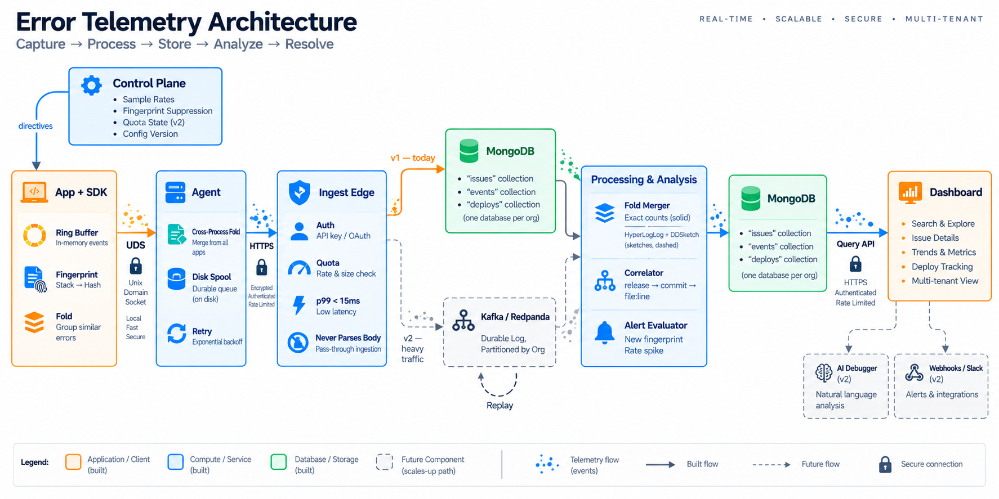

# BugBuster

An error-first observability platform. Unlike OpenTelemetry — which treats grouping as a backend
concern — BugBuster fingerprints and folds duplicate errors **client-side, in the SDK**, before
they ever touch the network. A 50,000-event error storm becomes a handful of aggregate records
plus a few full-fidelity exemplars, computed where the storm is happening, not after it's already
cost you the bandwidth.

This is a real distributed-systems project: the goal is engineering rigor at every layer, even
though current scale is intentionally small (a few pilot organizations, pre-production).



Solid-outlined boxes are what's actually built and running today (v1); dashed boxes — Kafka/
Redpanda as a durable log, HyperLogLog/DDSketch aggregation, the AI Debugger, Slack/webhook
alerts — are the documented scale-up path, not yet built. See
[`docs/architecture/ingest-pipeline.md`](docs/architecture/ingest-pipeline.md) §10 for exactly
what triggers building each one.

## Why it's built this way

Read these before touching the code — they're the reasoning behind every design choice below,
not background color:

- **[`docs/architecture/ingest-pipeline.md`](docs/architecture/ingest-pipeline.md)** — the full
  design: the hot-path budget, the fold, sampling, the Agent, backpressure, the ingest edge, and
  §10's resolved decisions + growth triggers (what's deferred, and the measurement that brings
  each piece back).
- **[`docs/architecture/bugbuster-blueprint.html`](docs/architecture/bugbuster-blueprint.html)** —
  the same architecture as eight drawn plates. Open it in a browser.
- **[`docs/glossary.md`](docs/glossary.md)** — plain-English explanations of every term used above
  (p99, ring buffer, UDS, cardinality, sketches, circuit breakers...). Start here if any of that
  is unfamiliar.

## Repo map

One monorepo, package-per-architectural-component — reading `packages/` top to bottom is reading
the architecture diagram:

| Package | Role |
|---|---|
| [`packages/types`](packages/types) | The wire-format contract — envelope, event, issue, and header shapes shared by every other package. Change something here and the type-checker tells every consumer immediately. |
| [`packages/sdk-node`](packages/sdk-node) | The instrumentation SDK. Lives inside a customer's Node process; owns the hot path (<5µs budget), fingerprinting, and the in-process fold. |
| [`packages/agent`](packages/agent) | The required host-local daemon (v1). SDK talks to it over a Unix domain socket; it's the only thing that makes the network hop to the backend. |
| [`packages/backend`](packages/backend) | Ingest edge + processing + Query API. Resolves each request to its organization's own MongoDB database before touching any data. |
| [`packages/dashboard`](packages/dashboard) | Minimal read-only issue viewer against the Query API — no build step, single HTML file. |
| [`examples/demo-app`](examples/demo-app) | A small Express app instrumented with `sdk-node`, plus the genuine end-to-end test wiring every component together for real. |

## Getting started

```bash
pnpm install
pnpm build
pnpm test:unit
```

For the API surface, see [`docs/api.md`](docs/api.md); for the MongoDB schema,
[`docs/schema.md`](docs/schema.md).

## Quickstart: see your first telemetry end-to-end

Five steps, four terminals. By the end, an error thrown in a real Node app will have been
captured, fingerprinted, and folded by the SDK; carried over a Unix domain socket to the Agent;
forwarded over HTTPS (zstd-compressed) to the backend; written into a tenant-isolated MongoDB
database; and shown on the dashboard — every hop real, nothing mocked.

### 0. Prerequisites

Node.js 20+, pnpm 10+, and a MongoDB instance — either local (Docker) or a free
[MongoDB Atlas](https://www.mongodb.com/cloud/atlas) cluster. If you're using Atlas, keep the
connection string out of every file — pass it only as an environment variable, never commit it
(it has credentials embedded in it, unlike a local `mongodb://localhost` URI).

### 1. Install and build

```bash
pnpm install
pnpm build
```

### 2. Start MongoDB

```bash
docker compose -f infra/docker-compose.yml up -d
```

(Using Atlas instead? Skip this — just use your connection string in place of
`mongodb://localhost:27017` in step 3 and in Terminal A of step 4 below, and make sure your IP is
allowlisted under Atlas → Network Access.)

### 3. Create an organization

There's no signup flow yet — a CLI creates the org record directly:

```bash
cd packages/backend
pnpm create-org org_demo "Demo Org" bugbuster_org_demo demo-api-key
cd ../..
```

`demo-api-key` is the API key you'll use in every step below — pick your own if you like.

### 4. Start the three long-running processes (one terminal each)

**Terminal A — backend**

```bash
cd packages/backend
BUGBUSTER_CONTROL_DB_URI=mongodb://localhost:27017 PORT=8080 pnpm start
```

**Terminal B — Agent**

```bash
cd packages/agent
BUGBUSTER_AGENT_SOCKET=/tmp/bugbuster-agent.sock \
BUGBUSTER_BACKEND_URL=http://localhost:8080/ingest \
BUGBUSTER_API_KEY=demo-api-key \
pnpm start
```

On Windows, use a named pipe path instead of a filesystem path:
`$env:BUGBUSTER_AGENT_SOCKET = "\\.\pipe\bugbuster-agent"` (PowerShell).

**Terminal C — the instrumented demo app**

```bash
cd examples/demo-app
BUGBUSTER_API_KEY=demo-api-key \
BUGBUSTER_AGENT_SOCKET=/tmp/bugbuster-agent.sock \
pnpm dev
```

### 5. Generate some telemetry

```bash
curl http://localhost:3000/throw
curl http://localhost:3000/throw   # again — folds into the SAME issue, count becomes 2
```

### 6. See it

**The dashboard** (this is the real answer to "where do I see the telemetry"):

```bash
cd packages/dashboard
pnpm dev
```

Open **http://localhost:5173**, enter:
- Backend URL: `http://localhost:8080`
- API key: `demo-api-key`

Click **Load issues** — one row: the fingerprinted error, `count: 2`, and a green "exact" fidelity
badge. Click the row for the full JSON, including which exemplar events are attached.

**Or the raw API**, if you'd rather skip the browser:

```bash
curl http://localhost:8080/issues -H "Authorization: Bearer demo-api-key"
```

### What you just saw

Two identical throws became **one issue with count 2**, not two separate log lines — that's the
whole thesis of this project: fingerprinting and folding happen client-side, in the SDK, before
anything crosses the network. The path that data actually took:

```text
demo-app (SDK captures → fingerprints → folds)
   │  UDS / named pipe
   ▼
Agent (cross-process fold merge, zstd compression)
   │  HTTPS
   ▼
Backend (tenant-isolated MongoDB write)
   │
   ▼
Dashboard (Query API)
```

Every hop above is exercised for real, automatically, in
[`examples/demo-app/test/full-pipeline.test.ts`](examples/demo-app/test/full-pipeline.test.ts) —
run `pnpm --filter @bugbuster/demo-app test:integration` to see it happen without touching a
terminal by hand.

## Status

Architecture resolved and implemented end-to-end: every package above is built and tested,
including a genuine cross-component integration test
(`examples/demo-app/test/full-pipeline.test.ts`) exercising a real SDK → real Agent (over a real
Unix domain socket) → real backend (over real HTTP, real zstd compression) → real MongoDB → real
Query API. That test caught four real bugs no single package's own tests could have found alone —
see `examples/demo-app/README.md` for what they were and why isolated testing missed them.

```bash
pnpm test:unit          # every package's unit tests — no external services needed
pnpm --filter @bugbuster/backend test:integration   # real MongoDB via mongodb-memory-server
pnpm --filter @bugbuster/demo-app test:integration  # the full end-to-end pipeline
```

What's deliberately not built yet, and why, is tracked in
[`docs/architecture/ingest-pipeline.md`](docs/architecture/ingest-pipeline.md) §10's growth
triggers — each is a measurement, not a date.
